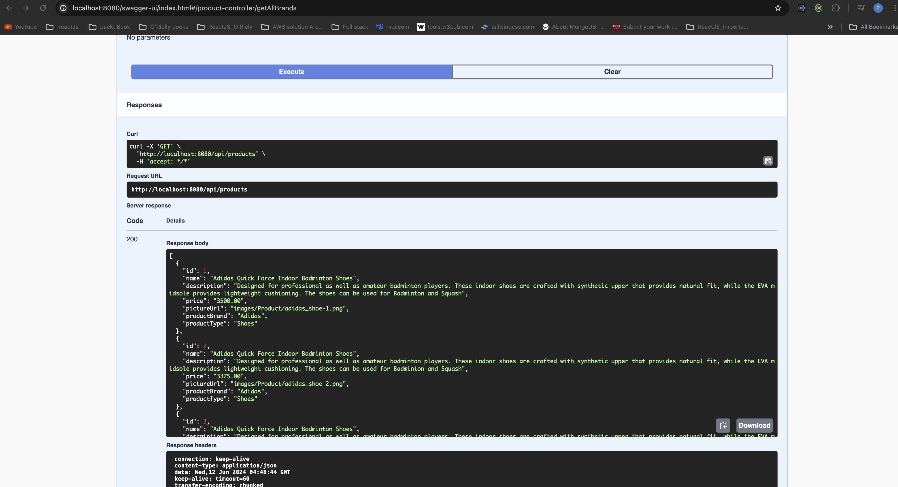
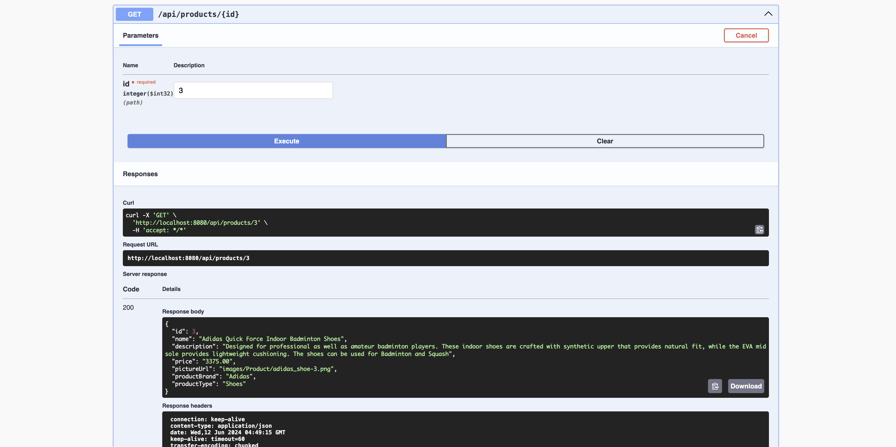

# SportCenterApp_SpringBoot_React
* Add Swagger dependency in pom.xml file 
```
<!-- https://mvnrepository.com/artifact/org.springdoc/springdoc-openapi-starter-webmvc-ui -->
<dependency>
    <groupId>org.springdoc</groupId>
    <artifactId>springdoc-openapi-starter-webmvc-ui</artifactId>
    <version>2.5.0</version>
</dependency>
<dependency>
	<groupId>org.springframework.boot</groupId>
	<artifactId>spring-boot-starter-data-redis</artifactId>
	<version>3.3.0</version>
</dependency>
```

# API End point validation usnig Swagger - UI




