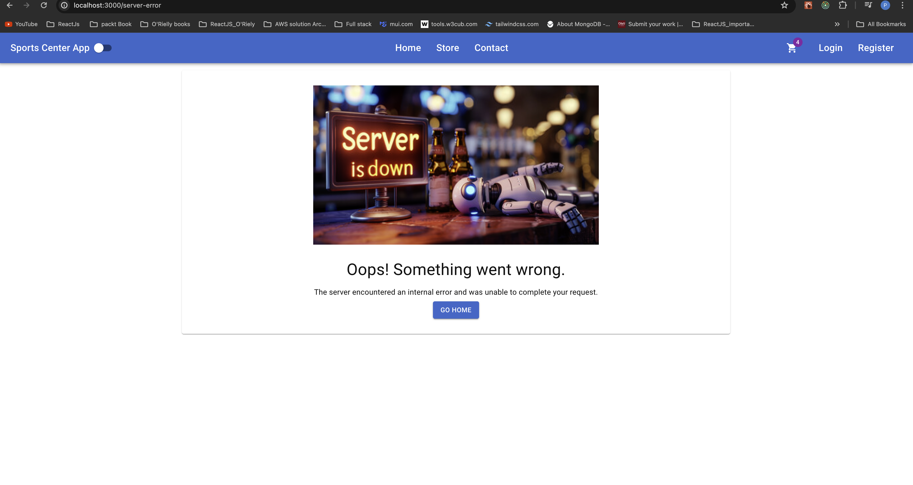
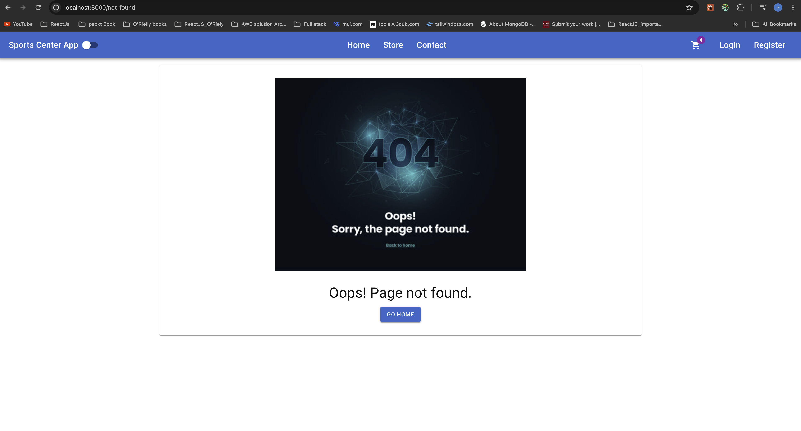
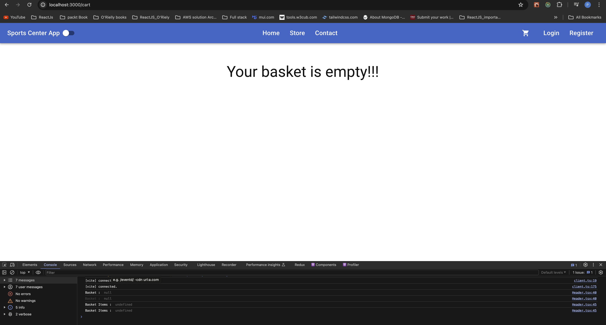
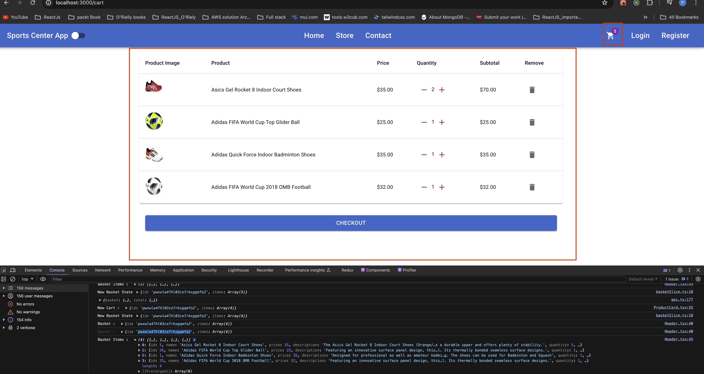
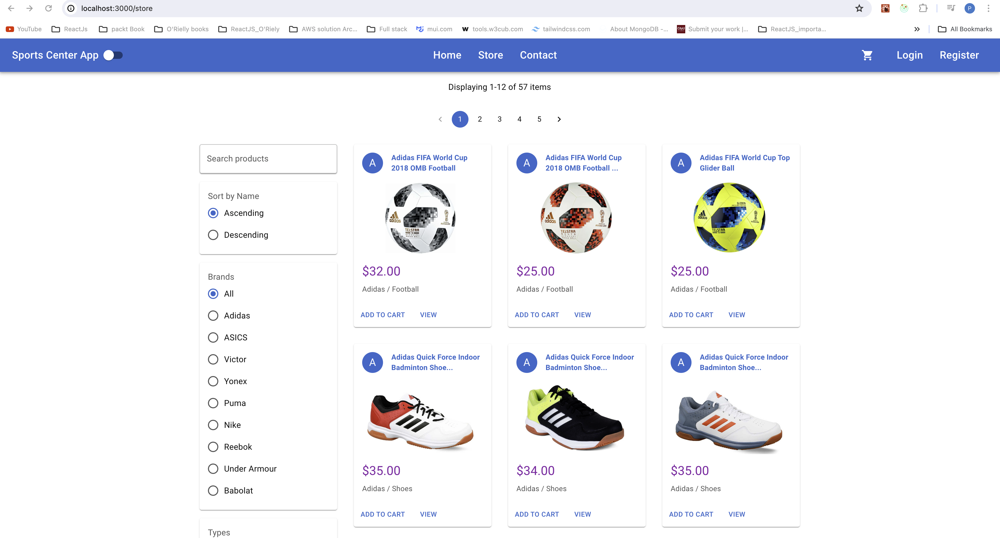
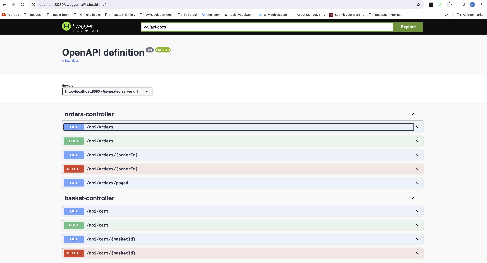
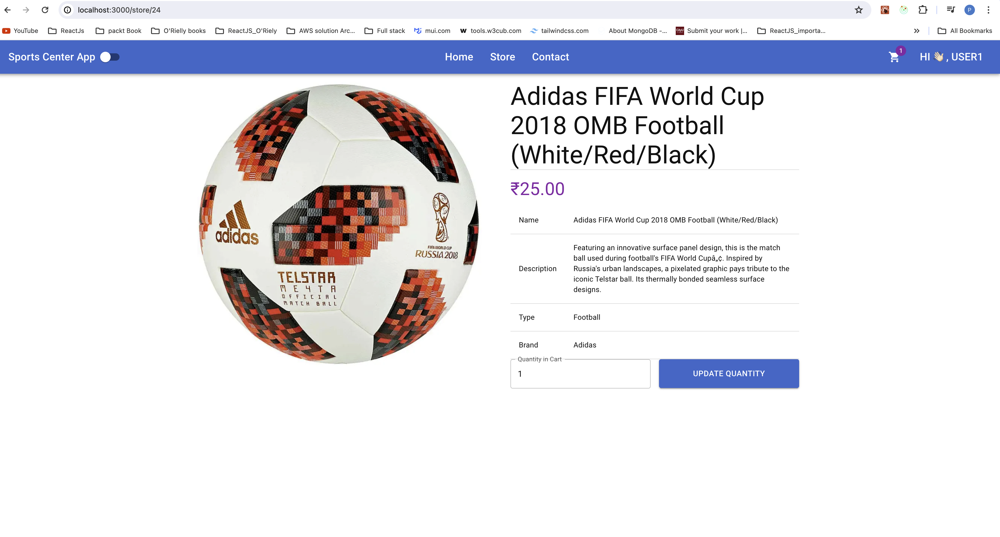
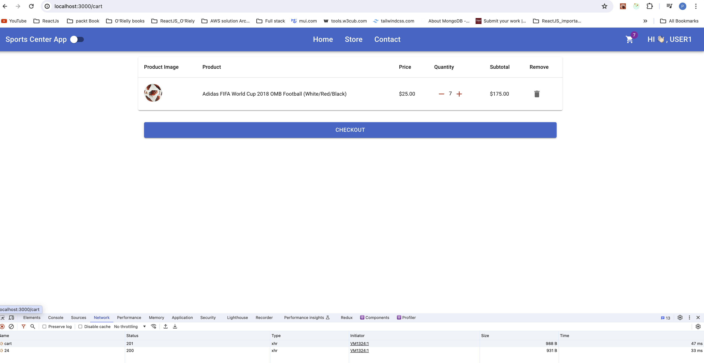

# SportCenterApp_SpringBoot_React
* Add Swagger and redis data dependency in pom.xml file 
```
<!-- https://mvnrepository.com/artifact/org.springdoc/springdoc-openapi-starter-webmvc-ui -->
<dependency>
    <groupId>org.springdoc</groupId>
    <artifactId>springdoc-openapi-starter-webmvc-ui</artifactId>
    <version>2.5.0</version>
</dependency>
<dependency>
	<groupId>org.springframework.boot</groupId>
	<artifactId>spring-boot-starter-data-redis</artifactId>
	<version>3.3.0</version>
</dependency>
<!-- MapStruct dependencies -->
<dependency>
	<groupId>org.mapstruct</groupId>
	<artifactId>mapstruct</artifactId>
	<version>1.5.2.Final</version>
</dependency>
<dependency>
	<groupId>org.mapstruct</groupId>
	<artifactId>mapstruct-processor</artifactId>
	<version>1.5.2.Final</version>
	<scope>provided</scope>
</dependency>
```

# API End point validation usnig Swagger - UI


* Server Error Page


* Page Not Found for any incorrect path


* Initial Cart page and Cart with Items











